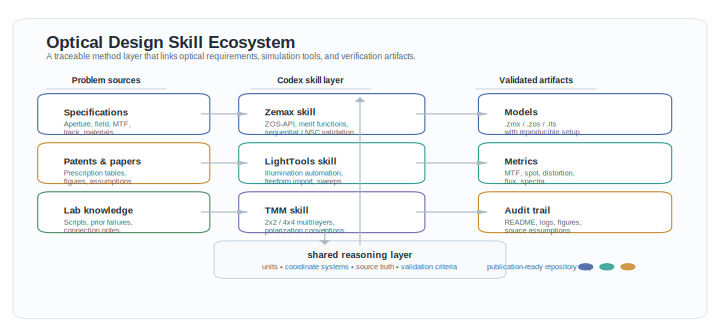
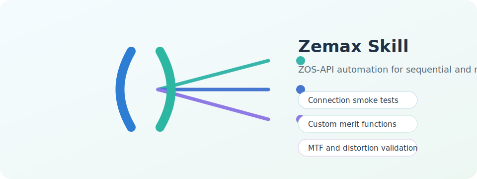
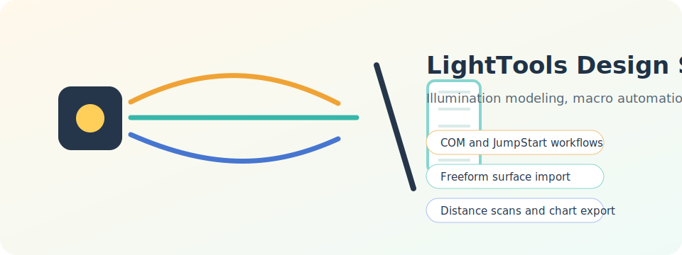
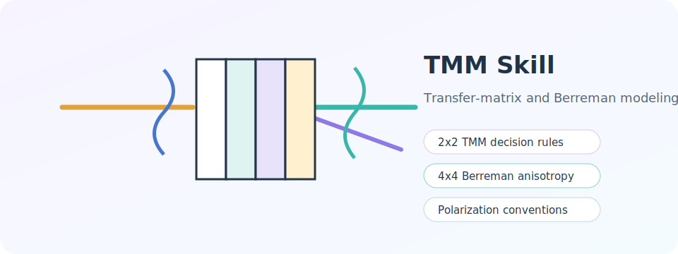

# Optical Design Skill Ecosystem

A publication-style method map of the repository: problem sources flow into the Codex skill layer, then into validated optical models, metrics, and audit artifacts.

Codex skills for building an intelligent Optical Agent that unifies fragmented simulation software, analytical methods, and engineering experience into one cohesive design ecosystem.

This repository is an early knowledge base for connecting tools such as Zemax, LightTools, FDTD solvers, transfer-matrix methods, freeform optics workflows, paper reproduction notes, and practical automation patterns. The goal is not to replace specialized optical software, but to make them work together through a shared reasoning layer, reusable workflows, and traceable design artifacts.

## Vision

Modern optical design is powerful but fragmented. A single project may require:

- Zemax or sequential/non-sequential ray tracing.
- LightTools illumination modeling and macro automation.
- FDTD or RCWA-style electromagnetic simulation.
- Transfer matrix methods for multilayer films, DBRs, anisotropic media, and liquid crystal stacks.
- Python scripts for data processing, optimization, plotting, and validation.
- Paper reproduction workflows that turn published figures and tables into working models.

This repository collects Codex skills that help an agent move across those boundaries with memory, structure, and engineering discipline.

## Current Skills

### Zemax Skill

Path: [`zemax-skill/`](./zemax-skill/)

This skill captures practical Zemax OpticStudio and ZOS-API experience for repeatable optical-design automation. It includes:

- Standalone and Interactive Extension connection triage.
- Sequential lens optimization workflow and custom merit-function guidance.
- MTF, distortion, spot, wavefront, and prescription validation patterns.
- Non-sequential component setup, detector extraction, and flux/pupil checks.
- A reusable `zemax_connection_smoke.py` script for local ZOS-API smoke testing.

### LightTools Design Skill

Path: [`lighttools-design-skill/`](./lighttools-design-skill/)

This skill captures practical experience for reproducing optical papers and building validated Synopsys LightTools models. It includes:

- COM and JumpStart automation patterns.
- Freeform surface import into `.lts` models.
- LED source and receiver setup.
- Prism texture and DBHM modeling lessons.
- LightTools macro experience for parameter sweeps, object lookup, simulation runs, and chart export.

### TMM Skill

Path: [`TMM skill/`](./TMM%20skill/)

This skill focuses on transfer-matrix modeling for isotropic and anisotropic multilayer systems. It includes:

- 2x2 TMM vs 4x4 Berreman decision rules.
- Coordinate and polarization conventions.
- DBR, thin-film, liquid crystal, and rotated optical-axis modeling notes.
- `pyllama`-related experience and reference material.

## Design Principle

The Optical Agent should produce results that are:

- **Interconnected**: outputs from one tool can become inputs to another.
- **Traceable**: every model has source data, assumptions, scripts, and audits.
- **Physically grounded**: coordinate systems, units, polarization definitions, and energy checks are explicit.
- **Reproducible**: paper figures and simulation results can be rebuilt from saved workflows.
- **Extensible**: new software, methods, and lab-specific procedures can be added as skills.

## Contribution Ideas

Contributions are welcome. Useful additions include:

- Zemax skills for lens design, tolerancing, merit functions, and ZOS-API automation.
- FDTD / RCWA skills for metasurfaces, gratings, nano-optics, and field extraction.
- COMSOL or multiphysics coupling workflows.
- More LightTools macro examples and validated `.lts` automation patterns.
- Benchmark cases that compare analytical methods with commercial simulation outputs.
- Paper reproduction workflows with clear assumptions and validation plots.
- Scripts that convert data between tools, such as surface grids, ray files, spectra, material data, and receiver maps.

## Repository Philosophy

This is a growing workshop, not a finished product. Each skill should help an optical agent do real engineering work more reliably: understand the problem, choose the right method, automate the right tool, validate the result, and leave a clear trail for the next person.

If you have experience with optical simulation, analytical modeling, fabrication constraints, or experimental validation, your notes can become part of the shared design intelligence here.
